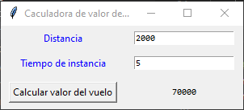
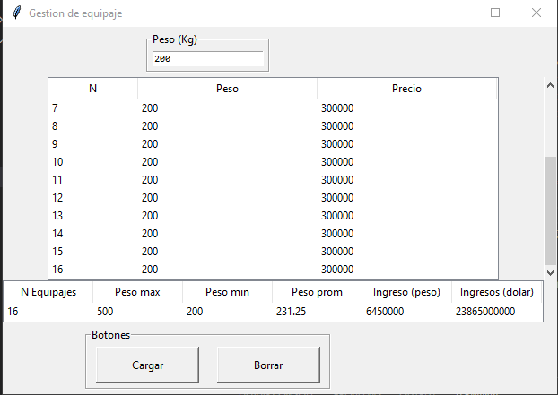

# PRUEBA TÉCNICA SOFKA (Algoritmo y lógica de promación).

_El proyecto consiste principalmente en dar respuesta mediante dos programa a dos problemas planteados en el segundo punto de la prueba técnica, en los cuales realicé mediante codigo de python una interfaz gráfica que permite realizar las acciones que piden en cada punto._

__observación: para correr ambos programas debe hacerse por consola utilizando:__

~~~
python punto2_a.py
python punto2_b.py
~~~

## Punto 2a 🚀
1.Determine el valor de un pasaje en avión, conocimendo la distancia a recorrer, el número de días de estancia, y sabiendo que si la distancia a recorrer es superior a 1000 km y el número de días de estancia es superior a 7, la línea aérea le hace un descuento del 30%(el precio por km es de 35.00 pesos).


### Pre-requisitos 📋

_Los puntos los  programé en el lenguaje de programación python 3.8.5, especificamente en este primer punto importé la librería tkinter, esta libreria viene preinstalada con la versión de python,también utilicé la función messagebox de la librería tkinter._

~~~
import tkinter as tk 
from tkinter import messagebox
~~~

_La librería tkinter permite realizar interfaz gráfica, de ésta librería utilicé especificamente funciones como_

~~~
tk.Tk() -> establece la ventana raiz predeterminada para enlazar los objetos con la interfaz gráfica.
tk.label -> crea etiquetas en la ventana de la interfax gráfica
tk.Entry -> crea caja de texto en la ventana de la interfaz gráfica 
tk.Button-> crea botones en la ventana de la interfaz gráfica
~~~

### definición de funciones 🔧

_en la segunda parte del código definí la función price_calculate, a la cual le ingresé los parámetros distance, time_instance, px_km=35), los ingresos de los valores de distance y time_instance los explicaré posteriormente en el ingreso de datos en la ventana de interfaz gráfica._ 

_Esta función lo que hace es calcular el precio del vuelo tendiendo en cuenta los parámetros antes mencionados, internamente realiza una clasificación del valor de distancia que se ingresa y de tiempo de estancia para verificar con un condicional if si cumple con las restricciones para realizar el descuento del 30% en el vuelo._

_tambien le introducí restricciones para que solo aceptara  numeros positivos y enteros, la función messagebox de tkinter me permitió imprimir un mensaje de error mediante una ventana emergente en la interfax gráfica cuando no se cumplan estas restricciones._

_text_output.configure(text=str(price)), coge el output de la función y la ingresa en el algoritmo de interfaz gráfica._
```
def price_calculate(distance,time_instance,px_km=35):
    try:
        d=int(distance)
        t=int(time_instance)
        if (d<0) or (t<0):
            messagebox.showerror("Error", "los valores ingresados deben ser positivos.")
            text_dist.delete(0, 'end')
            text_time_instance.delete(0, 'end')
        else:
            price_temporal= (d*px_km)
            if (d > 1000) and (t > 7):
                price=price_temporal*0.7
            else:
                price=price_temporal
    
            text_output.configure(text=str(price))
    except ValueError:
        
        messagebox.showerror("Error", "valor ingresado no es valido, debe ser número entero.")
        text_dist.delete(0, 'end')
        text_time_instance.delete(0, 'end')
          
```
_ En text_dist.delete(0, 'end') y  text_time_instance.delete(0, 'end'), se utilizó el atributo ".delete()" de la función tk.Entry de la libreria tkinter, la cual elimina los valores ingresados enla caja de texto en la ventana de interfaz gráfica cuando bote menssage de error, es decir cuando no se cuamplan las restricciones que comenté ateriormente_
       

## INTERFAZ GRÁFICA ⚙️

_En la tercera aprte del código se muestra la construccíon del algoritmo de interfaz gráfica, primero se programa la raiz con tk.TK() y le asigné el nombre con master.title()._

~~~
master = tk.Tk() ###raiz
master.title("Caculadora de valor de pasaje en avión ")
~~~


_En el siguiente fragmento del código se crea la etiqueta Distancia en la ventana de interfaz gráfica con tk.label, con el atributo de tkinter ".grid" le di la posición a la etiqueta "Distancia" en la ventana de la interfaz gráfica y con el atributo ".config" programe el color para la etiqueta._ 
~~~
label_dist= tk.Label(master, text="Distancia")
label_dist.grid(column=1,row=1,padx=10,pady=5)
label_dist.config(fg="blue")
~~~


_ Esta parte del código se repite el programa para crear la etiqueta "Tiempo de estancia", darle ubicación y establecer el color de la etiqueta._
~~~
label_time_instance= tk.Label(master, text="Tiempo de estancia")
label_time_instance.grid(column=1,row=3,padx=10,pady=5)
label_time_instance.config(fg="blue")
~~~

_Luego programé el arlgotimo para crear la caja de texto donde el cliente puede ingresar los valores de "Distancia" y "Tiempo de estancia" con text_dist=tk.Entry ( master,font=("Consolas", 8)) y  text_time_instance=tk.Entry ( master ,font=("Consolas", 8)) respectivamente._
_Acá utilicé nuevamente el atributo ".grid" para darle ubicación a las cajas de texto. 
~~~ 
text_dist=tk.Entry ( master,font=("Consolas", 8))
text_dist.grid(column=3,row=1,padx=10,pady=5)

text_time_instance=tk.Entry ( master ,font=("Consolas", 8))
text_time_instance.grid(column=3,row=3,padx=10,pady=5)
~~~


_En la siguiete linea del programa realicé el botón para calcular el valor del vuelo, cuando se  ingresan los datos de "Distancia" y "tiempo de estancia", el boté ejercuta la función y la función interna hace la operación del valor del vuelo._

~~~
button_price=tk.Button(master,text="Calcular valor del vuelo",
                            command=(lambda: price_calculate(text_dist.get(),text_time_instance.get())))
button_price.grid(column=1,row=5, padx=10,pady=5)
~~~


_Finalemente cree otra etiqueta en la ventana de interfaz gráfica para la salida del resultado del programa asignado con la función price_calculate.
~~~
text_output= tk.Label( master ,width=20,height=2,font=("Consolas", 8))
text_output.grid(column=3,row=5, padx=10,pady=5)
~~~

_se cierra el código con tkinter para realizar la interfaz gráfica  defecto con tk.mainloop_
~~~
tk.mainloop()

~~~

### Analisis del programa 🔩

_El algoritmo lo que hace en general es que mediante una ventana de interfaz gráfica pide dos variables que son la distancia y tiempo de estancia, estas dos determinan el valor final del precio del vuelo, entonces se ingresan mediante un botón y el programa internanmente verifica el tipo de variable si es numerica  o tipo string o si es entero positivo, luego mete el valor de la distancia en un intervalo definiendo si cumple para realizar el descuento o no, finalmente esa función genera un valor que se enlaza con la interfaz gráfica, de tal manera que de forma isntantanea se puede ver el resultado del valor del vuelo de una persona._


### Resultado gráfico 



## Punto 2b 🚀
2.Un BOING 747 tiene una capacidad de carga para equipaje de aproximadamente 18.000
kg. Confeccione un algoritmo que controle la recepción de equipajes para este avión,
sabiendo que:
• Un bulto no puede exceder la capacidad de carga del avión ni tampoco exceder los 500
Kg.
• El valor por kilo del bulto es:
- de 0 a 25 Kg. cero pesos
- de 26 a 300 Kg. 1500 pesos por kilo de equipaje.
- de 301 a 500 Kg. 2500 pesos por kilo de equipaje
Para un vuelo cualquiera se pide:
a) Número total de bultos ingresados para el vuelo
b) Peso del bulto más pesado y del más liviano
c) Peso promedio de los bultos
d) Ingreso en pesos y en dólares por concepto de carga. Construya una tabla de
seguimiento con no menos de 15 bultos para realizar la prueba del algoritmo.


### Pre-requisitos 📋

_Para este segundo punto tambien utilicé la versión de python 3.8.5, importé la librería tkinter, esta libreria viene preinstalada con la versión de python,también utilicé la función messagebox de la librería tkinter._

~~~
import tkinter as tk
from tkinter import ttk,messagebox
~~~

_La librería tkinter permite realizar interfaz gráfica, de ésta librería utilicé especificamente funciones como:_

~~~
tk.Tk() -> establece la ventana raiz predeterminada para enlazar los objetos con la interfaz gráfica.
tk.label -> crea etiquetas en la ventana de la interfax gráfica
tk.Entry -> crea caja de texto en la ventana de la interfaz gráfica 
tk.Button-> crea botones en la ventana de la interfaz gráfica
tk.LabelFrame -> Realiza espacio para diseños mas avanzados de ventana de interfaz gráfica
ttk.Treeview -> función de la sublibrería ttk de tkinter
tk.Scrollbar -> Realiza un controlador dezlizante de dezplanzamiento vertical 
~~~

### definición de  variables y funciones 🔧

_En este paso definí las variables que necesitaba para resolver el problema._
~~~
cols=["N","Peso","Precio"]
cols_2=["N Equipajes","Peso max","Peso min","Peso prom","Ingreso (peso)","Ingresos (dolar)"]
approx_capacaity = 18000
m_bulto=500
dolar=3700
data_tabla=[]
~~~

_En esta sección del código empecé a definir funciones_

_La primera función que se presenta a continuación establecí al algoritmo que realiza la restricción de que en el vuelo BOING 747 tiene una capacidad de carga para equipaje de aproximadamente 18.000, en la cual la función peso_limite mediante un condiconal if restinge que lo que ingrese como bulto en la lista data_tabla, la suma no supere esta restricción.
~~~
def peso_limite(bulto):
    if len(data_tabla)==0:
        precio_bulto(bulto)
    elif len(data_tabla)>0:
        if sum( [ k[0] for k in data_tabla ] )< approx_capacaity:
            precio_bulto(bulto)
        else:
            messagebox.showerror("Error", "El peso del equipaje excede la capacidad del avión")
            
~~~

_En la función precio_bulto se encuentra el precio de cada bulto ingresado dependiendo del intervalo donde se encuentre en los condicionales agregando los valores precio y vulto al final del condicional en una lista de listas data_tabla, luego se ingresa dentro de try- except para generar un mensaje de error si no cumple con las restricciones de ser un número entero, que peso del bulto sea positio y maximo de 500 por bulto._
~~~

def precio_bulto(bulto):
    try:
        bulto=int(bulto)
        if (bulto>=0) and (bulto<=500):
            precio=0
            if (bulto>=0) and  (bulto<=25):
                precio=0
            elif (bulto>=26) and (bulto<=300):
                precio= 1500*bulto
            else:
                precio= 2500*bulto
            data_tabla.append([bulto,precio])
        
            
        else:
            text_bulto.delete(0, 'end')
            messagebox.showerror("Error", "El valor ingresado excede el límite de peso por equipaje")
        show()
        resumen()

    except ValueError:
        
        messagebox.showerror("Error", "Valor ingresado no es valido, debe ser numero entero.")
        text_bulto.delete(0, 'end')
~~~


_la función show() limpia listBox y vuelve a llenarla con los valores de la data_tabla._

~~~
def show():
    for i in listBox.get_children():
        listBox.delete(i)
    for i, (peso, precio) in enumerate(data_tabla, start=1):
        listBox.insert("", "end", values=(i, peso, precio))
~~~
_la función resumen() me permite calcular en numero total de bultos, numero maximo de peso ingresado, el numero min de peso ingresado, el promedio total de peso ingresado, el ingreso total en peso y el ingreso total en dolar._
~~~

def resumen():
    list_resumen.insert("", 0,values=(len(data_tabla),
                                            max( [ k[0] for k in data_tabla ] ),
                                            min( [k[0] for k in data_tabla ] ),
                                            sum( [ k[0] for k in data_tabla ] ) / len(data_tabla),
                                            sum( [ k[1] for k in data_tabla ] ),
                                            sum( [k[1] for k in data_tabla] ) * dolar
                                            ))
~~~
_la función delete() borra las filas de las tablas de la interfaz gráfica._
~~~
def delete():
    for i in listBox.get_children():
        listBox.delete(i)
    for j in list_resumen.get_children():
        list_resumen.delete(j)
    text_bulto.delete(0, 'end')
~~~


## INTERFAZ GRÁFICA ⚙️

_Se muestra la construccíon del algoritmo de interfaz gráfica, primero se programa la raiz con tk.TK() y le asigné el nombre con master.title()._
~~~~
master = tk.Tk() 
master.title("Gestion de equipaje ")
~~~~
_En el siguiente algoritmo cree la etiqueta para "Peso (kg) en la ventana de interfaz gráfica con ".LabelFrame" y le puse la ubicanción dentro de esta ventana con ".grid", luego con ".Entry" cree la caja de texto de entrada para el peso, con su respectiva ubicación con ".grid"_
~~~
frame_bulto=tk.LabelFrame(master,text="Peso (Kg)")
frame_bulto.grid(column=5,row=1,padx=20,pady=5)

text_bulto=tk.Entry( frame_bulto,font=("Consolas", 8))
text_bulto.grid(column=5,row=1,padx=5,pady=5)

~~~
_En este algoritmo cree 2 botones, primero realicé la etiqueta con ".LabelFrame" y su ubicación con ".grid"., luego cree el botón para "Cargar" el cual carga los datos ingresados de peso al objeto listBox y le di ubicación con ".grid", también cree el botón "Borrar" siguiendo la misma lógica._
~~~
frame_buttons=tk.LabelFrame(master,text="Botones")
frame_buttons.grid(column=5,row=5,padx=20,pady=5)

button_bulto=tk.Button(frame_buttons,text="Cargar", 
                        height=2,width =15, 
                        command=(lambda: peso_limite(text_bulto.get())))
button_bulto.grid(column=1,row=1, padx=10,pady=5)


button_borrar=tk.Button(frame_buttons,text="Borrar", height =2,width = 15,command=delete)
button_borrar.grid(column=3,row=1, padx=10,pady=5)
~~~
_Este algoritmo le da el tamaño al objeto listBox_
~~~

listBox= ttk.Treeview(master, columns=cols, show='headings')
listBox.column(cols[0], minwidth=0, width=100, stretch=False)
listBox.column(cols[1], minwidth=0, width=200, stretch=False)
listBox.column(cols[2], minwidth=0, width=200, stretch=False)
~~~
~~~
for col in cols:
    listBox.heading(col, text=col)
listBox.grid(column=5,row= 3,columnspan=2)
~~~

_Aquí programé un controlador deslizante para el objeto list.Box_
~~~
scroll_log=tk.Scrollbar(master,command=listBox.yview,width=15)
listBox.config(yscrollcommand=scroll_log.set)
scroll_log.grid(row=3,column=7,sticky="nsew")
~~~
_En este algoritmo le di dimesiones a la list_resumen y para ponerle las etiquetas a las columnas y su ancho_
~~~
list_resumen= ttk.Treeview(master, columns=cols_2, show='headings',height = 1)
for col in cols_2:
    list_resumen.column(col, minwidth=0, width=100, stretch=False) 
    list_resumen.heading(col, text=col)
list_resumen.grid(column=5,row= 4,columnspan=2)
~~~
    
_Se debe terminar el programa cerrando  con tk.mainloop() para que funcione la interfaz y de esta manera cada que se haga un cambio se vuel va correr todo el programa en la librería tkinter_
~~~
tk.mainloop()
~~~


### Analisis del programa 🔩

Este programa recibe los datos de peso  para controlar la entrada de equipaje a un vuelo, se ingresa el peso del equipaje o bulto el programa lo recibe si cumple con las restricciones(entero positivo, y que no sea texto), si no pasa bota un mesanje de error en una ventana emergente y limpia la caja de texto, si lo recibe procede a calcular el valor del bulto o equipaje dependiendo del intervalo en que se encuentre.

Este programa recibe todos los equipajes hasta completar el maximo de capacidad del avión de 18000 kg y metiendo a la vez max 500 kg, cada vez que se ingresa un valor, el algoritmo calcula o cumula el resumen de número de bulto, max de peso ingresado , min de peso ingresado, promedio de los pesos ingresados, los ingresos totales en pesos y dolar.

Quiero resaltar que mi idea final era genera una base de datos para que se guardaran en excel sin embargo por el tiempo no lo pude realizar, de esta manera sería mas provechoso el algoritmo.

### Resultado gráfico



